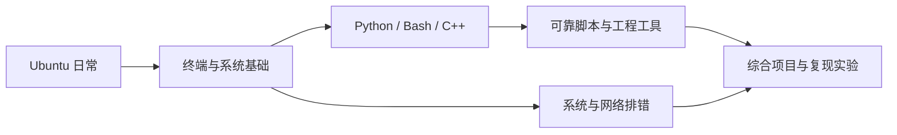

# Ubuntu 与 Linux 学习仓库

面向零基础，从 Ubuntu 日常操作走向可靠脚本、程序工程、系统排错和可复现实验。现有 **36 节基础课 + 24 节进阶课，共 60 节**，另有 **6 个综合项目**。主环境为本机 Ubuntu 22.04.5 + 系统 Python 3.10；运行时不依赖 cv 或 ROS 的环境。

## 从哪里开始

1. 零基础从 [U01](course/lessons/ubuntu_basics/01_linux_ubuntu/README.md)开始；已有经验先看[按目标选择路线](course/START_HERE.md)。完整内容在[60 节总目录](course/README.md)。
2. 每课先理解、预测，再操作；对照预期结果，做一个变式练习并回答自检。
3. 写程序前学 [P01：Python 环境](course/programming/01_python_environment/README.md)，按需提前学 [VS Code 调试](course/tools/02_vscode_debug/README.md)。
4. 当前要解决具体问题，查[场景索引](course/SCENARIOS.md)；检验独立能力，做[阶段任务](course/MILESTONES.md)。概念查[术语表](course/GLOSSARY.md)，命令查[速查表](course/CHEATSHEET.md)，报错查[故障指南](docs/TROUBLESHOOTING.md)。

## 课程地图

| 模块 | 内容 | 节数 |
| --- | --- | --- |
| [Ubuntu 日常操作](course/lessons/ubuntu_basics/README.md) | 桌面、文件管理、输入、设备设置、截图与记录 | 6 |
| [终端与命令行](course/lessons/terminal/README.md) | 命令结构、路径、文件、文本、搜索、管道、环境、归档 | 8 |
| [系统管理基础](course/lessons/system/README.md) | 权限、软件包、进程、服务、网络、磁盘 | 6 |
| [编程基础](course/programming/README.md) | Python、Bash 自动化、C++ 与 CMake | 10 |
| [Linux 配套工具](course/tools/README.md) | 编辑器、VS Code、Git、tmux、Docker 选修 | 6 |
| [Bash 与文本进阶](course/advanced/shell/README.md) | 展开、sed/awk、NUL 路径、退出、CLI、锁与原子写入 | 6 |
| [系统与网络进阶](course/advanced/systems/README.md) | /proc、性能、HTTP、SSH、定时器、增量备份 | 6 |
| [程序工程进阶](course/advanced/engineering/README.md) | 模型、测试、打包、并发、C++、调试、Git 恢复、Compose | 8 |
| [复现与排错](course/advanced/workflows/README.md) | 项目阅读、实验包、诊断方法、巡检实战 | 4 |

每节有操作页、理论页、变式练习和自检答案。基础每次约 30～60 分钟，进阶约 45～90 分钟，按自己的节奏推进；不设强制周作业。课程既检查正常结果，也练习失败分支。



## 先运行一个小实验

在 Ubuntu 终端中进入仓库：

```bash
cd /media/wdros/DataE/learning/Linux
bash scripts/study.sh environment
bash scripts/study.sh demo files
bash scripts/study.sh python variables
```

每次运行打印自己的实验目录，结果保存在 `scripts/runs/` 下，不覆盖上次输出。入口固定使用 `/usr/bin/python3`，本机默认 `python3` 指向 Miniforge，两者差异会在课程中解释。

完整运行说明见 [scripts/README.md](scripts/README.md)。课程建设时已跑通[热身与验收](docs/VALIDATION.md)，桌面、远端和管理员步骤按验证记录区分。

## 进入进阶与记录进度

```bash
bash scripts/advanced.sh doctor
bash scripts/advanced.sh lab quoting
bash scripts/advanced.sh lab cli
bash scripts/learn.sh catalog
bash scripts/learn.sh progress
```

[进阶导览](course/advanced/README.md)写明每课前置知识；[进阶运行指南](scripts/ADVANCED.md)列出全部 24 个实验。学习者完成变式和自检后可用 record 主动标记 learning/done/review；运行实验不会自动打勾。进度仅保存在本机，正式笔记与作品可另放 scripts/exercises/ 提交。

## 综合项目

| 项目 | 要学会什么 | 入口 |
| --- | --- | --- |
| [资料整理与备份](projects/organize/README.md) | 分类、保留原件、归档、恢复校验 | `bash scripts/study.sh project organize` |
| [日志分析](projects/logs/README.md) | 解析记录、计数、报告异常格式 | `bash scripts/study.sh project logs` |
| [平均值程序调试](projects/debug/README.md) | 复现错误、断点观察、检查修复 | `bash scripts/study.sh project debug` |
| [参数化日志巡检](projects/cli_inspector/README.md) | 数据模型、参数、阈值、失败状态、归档 | `bash scripts/advanced.sh lab capstone` |
| [可复现实验包](projects/reproducible_run/README.md) | 种子、参数、源码/输入/输出摘要、恢复重跑 | `bash scripts/advanced.sh lab reproduce` |
| [Git 故障恢复](projects/git_rescue/README.md) | 真冲突、abort、语义解决、bisect | `bash scripts/advanced.sh lab git` |

## 仓库结构

```text
Linux/
├── README.md                     总入口
├── AGENTS.md                     后续协作约定
├── course/
│   ├── README.md                 60 节课程与学习顺序
│   ├── START_HERE.md             按目标选择路线
│   ├── MILESTONES.md             六个独立能力检查点
│   ├── SCENARIOS.md              25 个常见任务导航
│   ├── GLOSSARY.md               中英文术语
│   ├── CHEATSHEET.md             命令速查
│   ├── lessons/
│   │   ├── ubuntu_basics/        U01～U06
│   │   ├── terminal/             C01～C08
│   │   └── system/               S01～S06
│   ├── programming/             P01～P10
│   ├── tools/                   T01～T06
│   └── advanced/                H01～H06、N01～N06、E01～E08、R01～R04
├── projects/                    项目说明、思路、练习与完成标准
├── docs/                        环境、来源、故障与实测范围
└── scripts/                     所有可执行代码与教学资产
    ├── study.sh / lab.py         运行与验收入口
    ├── advanced.sh               进阶实验入口
    ├── advanced_lab.py           24 个进阶实验与验收
    ├── advanced/                模型、CLI、工作进程、测试、打包与 C++
    ├── learn.sh / learn.py       目录、进度与完整检查
    ├── warmup.sh                 最小全流程
    ├── programming/             Python、Bash、C++ 源码
    ├── projects/                基础项目源码；进阶项目在 advanced/
    ├── editor/                  可选 VS Code 工作区
    ├── templates/               学习记录模板
    ├── assets/                  课程清单
    ├── exercises/               可提交的个人练习（需要时新建）
    ├── practice/                草稿练习，不提交
    ├── runtime/                 环境、临时文件，不提交
    ├── runs/                    自动实验与日志，不提交
    └── memory → ~/.Codex/memory  本机全局记忆链接，不提交
```

新增源码全部放根目录 `scripts/`，课程文档放 `course/`，项目文档放 `projects/`。自动实验使用自己生成的少量数据；真实资料的整理、远程连接和系统设置由学习者在相应课程中手动练习。

## 本机与资料

当前环境与依赖路径见[环境说明](docs/ENVIRONMENT.md)，官方资料与版本差异见[资源说明](docs/RESOURCES.md)。仓库所在文件系统是 `ntfs3`，权限与链接行为以实验报告为准。

进阶课程的范围和证据见[进阶验收](docs/ADVANCED_VALIDATION.md)，资料见[进阶来源](docs/ADVANCED_RESOURCES.md)。

```bash
bash scripts/learn.sh check
bash scripts/advanced.sh smoke
```

原有源码保持原样，新增代码全部在 scripts/。检查还会核对原有 15 个源码摘要。手动桌面交互、真实 SSH、服务启用和容器构建与本地自动检查分别记录。

远端为 [xielingyun257/linux](https://github.com/xielingyun257/linux)。运行结果与环境目录被忽略；提交自己的学习代码前先检查差异，提交信息使用中文。
